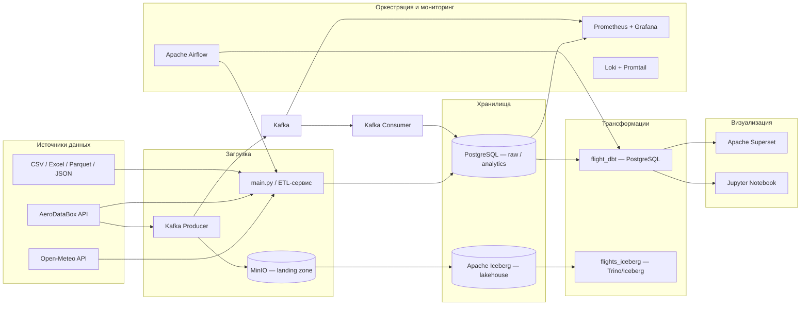

# Weather Airport — Data Engineering Pipeline

Проект анализирует влияние погодных условий на работу аэропорта: задержки рейсов, отмены и операционные метрики. Данные собираются из внешних API и локальных файлов, проходят через ETL-слой, трансформируются в dbt-моделях и визуализируются в BI-инструментах.

По умолчанию проект настроен на аэропорт **HKT** (Phuket International Airport), но аэропорт и координаты задаются через переменные окружения.

## Архитектура



### Потоки данных

1. **Batch ETL** (`main.py`) — загружает файлы из `data/` и данные API в схему `raw` PostgreSQL.
2. **Streaming** — Kafka Producer получает батчи рейсов из AeroDataBox, сохраняет сырьё в MinIO и публикует в топик `flight_events`; Consumer загружает сообщения в PostgreSQL с retry и DLQ (`flight_events.dlq`).
3. **Lakehouse** — сырые JSON из MinIO конвертируются в таблицы Apache Iceberg через PyIceberg; запросы выполняются через Trino.
4. **dbt** — два проекта: `flight_dbt` (основной, PostgreSQL) и `flights_iceberg` (Iceberg через Trino).
5. **Airflow** — ежемесячный пайплайн (файлы → API → dbt run/test) и условный запуск dbt при наличии данных.

## Стек технологий

| Категория | Технологии |
|-----------|------------|
| Язык | Python 3.12–3.13 |
| База данных | PostgreSQL 15 |
| ETL | pandas, SQLAlchemy, requests |
| Стриминг | Apache Kafka, kafka-python |
| Object storage | MinIO (S3-совместимое) |
| Lakehouse | Apache Iceberg, PyIceberg, Iceberg REST Catalog |
| SQL-движок | Trino |
| Трансформации | dbt (dbt-postgres, dbt-trino) |
| Оркестрация | Apache Airflow 3.x |
| BI | Apache Superset |
| Аналитика | Jupyter, matplotlib, scikit-learn |
| Мониторинг | Prometheus, Grafana, cAdvisor, postgres-exporter, kafka-exporter |
| Логирование | Loki, Promtail |
| Контейнеризация | Docker, Docker Compose |
| CI | GitHub Actions (dbt CI) |

## Структура проекта

```
Weather_Airport/
├── main.py                    # Точка входа ETL (run / files / api)
├── config.py                  # Конфигурация подключения к PostgreSQL
├── db.py                      # SQLAlchemy engine
├── requirements.txt           # Python-зависимости
├── docker-compose.yml         # Вся инфраструктура в Docker
├── Dockerfile                 # Образ для ETL и Jupyter
├── Dockerfile.airflow         # Образ Airflow
├── Dockerfile.superset        # Образ Superset
│
├── etl/
│   ├── extract/               # Извлечение: API и файловые источники
│   │   ├── aerodatabox_api.py # AeroDataBox FIDS API (RapidAPI)
│   │   ├── open_meteo_hourly.py
│   │   ├── csv_source.py, excel_source.py, parquet_source.py, json_source.py
│   ├── load/                  # Загрузка в PostgreSQL (raw-слой)
│   │   ├── raw_load.py
│   │   ├── aerodatabox_api_load.py
│   │   └── open_meteo_api_load.py
│   ├── kafka/
│   │   ├── producer.py        # API → MinIO + Kafka
│   │   └── consumer.py        # Kafka → PostgreSQL (+ DLQ)
│   ├── landing/
│   │   ├── minio_client.py    # Работа с bucket flight-raw-landing
│   │   └── read_from_minio.py
│   └── lakehouse/
│       ├── catalog.py         # PyIceberg REST catalog
│       ├── schemas.py         # Схемы Iceberg-таблиц
│       ├── transforms.py      # Преобразование батчей в строки
│       └── load_raw_to_iceberg.py
│
├── flight_dbt/                # Основной dbt-проект (PostgreSQL)
│   ├── models/
│   │   ├── staging/           # stg_* — очистка raw-данных
│   │   ├── core/
│   │   │   ├── dims/          # dim_airports, dim_airlines, dim_aircraft
│   │   │   └── facts/         # fact_flights, fact_weather
│   │   └── marts/             # mart_weather_flight_impact, mart_weather_impact_summary
│   ├── macros/                # generate_surrogate_key, range_category, flight_time_status
│   ├── seeds/                 # Тестовые/справочные CSV
│   ├── snapshots/             # SCD для airlines
│   └── tests/                 # Generic- и data-тесты
│
├── flights_iceberg/           # dbt-проект для Iceberg (Trino)
│   └── models/staging/        # stg_fids_range_arrivals, stg_fids_range_departures
│
├── airflow/dags/
│   ├── monthly_data_pipeline.py   # Ежемесячный ETL + dbt
│   ├── conditional_dbt_run.py     # dbt только при наличии данных
│   └── count_weather_raw_rows.py  # Пример PostgresHook
│
├── trino/catalog/
│   └── iceberg.properties     # Конфигурация Iceberg-каталога
│
├── notebooks/
│   └── weather_analysis.ipynb # Исследовательский анализ
│
├── tests/                     # pytest: тесты extract-модулей
├── prometheus.yml             # Конфигурация Prometheus
├── promtail-config.yml        # Сбор логов Docker-контейнеров
└── .github/workflows/
    └── dbt_ci.yml             # CI для flight_dbt
```

## Источники данных

| Источник | Описание | Raw-таблица |
|----------|----------|-------------|
| [Open-Meteo](https://open-meteo.com/) | Почасовая погода (Historical Forecast API) | `raw.weather_raw` |
| [AeroDataBox](https://aerodatabox.com/) (RapidAPI) | Рейсы: прилёты/вылеты, статусы, задержки | `raw.aerodatabox_fids_range` |
| Локальные файлы | Справочники и исторические данные | `raw.airports`, `raw.airlines`, `raw.flights_2025` и др. |

## Быстрый старт

### Требования

- Docker и Docker Compose
- Python 3.12+ (для локальной разработки)
- API-ключ [AeroDataBox на RapidAPI](https://rapidapi.com/aedbx-aedbx/api/aerodatabox)

### 1. Настройка окружения

Создайте файл `.env` в корне проекта:

```env
# PostgreSQL
POSTGRES_DB=flight_db
POSTGRES_USER=user_1
POSTGRES_PASSWORD=password_1
POSTGRES_PORT=5432

# Аэропорт и координаты (пример: Phuket)
AIRPORT_IATA=HKT
LAT=8.1132
LON=98.3169

# API
AERODATABOX_API_KEY=your_rapidapi_key

# MinIO
MINIO_ROOT_USER=minioadmin
MINIO_ROOT_PASSWORD=minioadmin

# Airflow
AIRFLOW_JWT_SECRET=your_jwt_secret
AIRFLOW_FERNET_KEY=your_fernet_key

# Superset
SUPERSET_SECRET_KEY=your_superset_secret

# Grafana
GF_SECURITY_ADMIN_USER=admin
GF_SECURITY_ADMIN_PASSWORD=admin
GRAFANA_SMTP_USER=
GRAFANA_SMTP_PASSWORD=

# ETL (опционально)
RAW_DATA_PATH=data
START_DATE=2025-01-01
END_DATE=2025-01-31
```

### 2. Запуск инфраструктуры

```bash
docker compose up -d
```

Первый запуск поднимет PostgreSQL, Kafka, MinIO, Iceberg REST, Trino, Airflow, Superset, Prometheus, Grafana и остальные сервисы.

### 3. ETL-пайплайн

```bash
# Полный пайплайн: файлы + API
docker compose run --rm etl python main.py run

# Только файлы из data/
docker compose run --rm etl python main.py files

# Только API (можно передать даты)
docker compose run --rm etl sh -c "START_DATE=2025-01-01 END_DATE=2025-01-31 python main.py api"
```

### 4. dbt-трансформации

```bash
cd flight_dbt
dbt deps
dbt seed --profiles-dir .
dbt run --profiles-dir .
dbt test --profiles-dir .
```

Для Iceberg-проекта (требуется запущенный Trino):

```bash
cd flights_iceberg
dbt run --profiles-dir .
```

### 5. Lakehouse (MinIO → Iceberg)

```bash
docker compose run --rm etl python -m etl.lakehouse.load_raw_to_iceberg
```

### 6. Kafka Producer

```bash
docker compose run --rm etl python -m etl.kafka.producer
```

Consumer запускается автоматически как сервис `kafka-consumer`.

## Сервисы и порты

| Сервис | URL / порт | Назначение |
|--------|------------|------------|
| PostgreSQL | `localhost:5432` | Основное хранилище (raw + analytics) |
| ETL | `localhost:8000` | Python ETL-сервис |
| Jupyter | `localhost:8888` | Notebooks (без токена) |
| Airflow | `localhost:8080` | Оркестрация DAG (admin / admin) |
| Kafka UI | `localhost:8081` | Просмотр топиков и сообщений |
| Superset | `localhost:8088` | BI-дашборды |
| Trino | `localhost:8090` | SQL-запросы к Iceberg |
| MinIO Console | `localhost:9001` | Управление S3-бакетами |
| MinIO API | `localhost:9000` | S3 endpoint |
| Iceberg REST | `localhost:8181` | REST Catalog |
| Prometheus | `localhost:9090` | Метрики |
| Grafana | `localhost:3000` | Дашборды мониторинга |
| Loki | `localhost:3100` | Агрегация логов |
| cAdvisor | `localhost:8085` | Метрики контейнеров |
| postgres-exporter | `localhost:9187` | Метрики PostgreSQL |
| kafka-exporter | `localhost:9308` | Метрики Kafka |

### MinIO buckets

- `flight-raw-landing` — сырые JSON-батчи из Kafka Producer
- `flight-lakehouse` — warehouse для Apache Iceberg

## dbt-модели (PostgreSQL)

Проект `flight_dbt` реализует классическую слоистую архитектуру:

| Слой | Схема | Примеры моделей |
|------|-------|-----------------|
| Staging | `staging` | `stg_weather_api`, `stg_aerodatabox_arrivals`, `stg_airports` |
| Core — Dimensions | `core` | `dim_airports`, `dim_airlines`, `dim_aircraft` |
| Core — Facts | `core` | `fact_weather`, `fact_flights` |
| Marts | `marts` | `mart_weather_flight_impact`, `mart_weather_impact_summary` |

Мarts объединяют погодные наблюдения с данными о рейсах и рассчитывают категории влияния погоды (ветер, осадки, видимость и т.д.).

## Airflow DAGs

| DAG | Расписание | Описание |
|-----|------------|----------|
| `monthly_data_pipeline` | `0 0 1 * *` (1-е число месяца) | load files → load API → dbt run → dbt test |
| `conditional_dbt_run` | Manual | dbt run только если `raw.weather_raw` не пуста |
| `postgres_hook_example` | Manual | Пример подсчёта строк через PostgresHook |

## Тестирование

```bash
# Unit-тесты extract-модулей
pytest tests/

# dbt-тесты (качество данных)
cd flight_dbt && dbt test --profiles-dir .
```

## CI/CD

GitHub Actions workflow `.github/workflows/dbt_ci.yml` запускается при изменениях в `flight_dbt/`:

- `dbt deps`, `dbt seed`, `dbt parse`, `dbt compile`, `dbt build`
- Используется PostgreSQL 15 как service container

## Переменные окружения

| Переменная | Описание | По умолчанию |
|------------|----------|--------------|
| `POSTGRES_*` | Подключение к PostgreSQL | — |
| `AIRPORT_IATA` | IATA-код аэропорта | `HKT` |
| `LAT`, `LON` | Координаты для Open-Meteo | `0` |
| `AERODATABOX_API_KEY` | Ключ RapidAPI | — |
| `RAW_DATA_PATH` | Путь к raw-файлам | `data/` |
| `START_DATE`, `END_DATE` | Период загрузки API | последние 30 дней |
| `MINIO_ROOT_USER/PASSWORD` | Учётные данные MinIO | — |
| `MINIO_PREFIX` | Префикс объектов в MinIO | `""` |

## Лицензия

Учебный / pet-project. Используйте на своё усмотрение.
